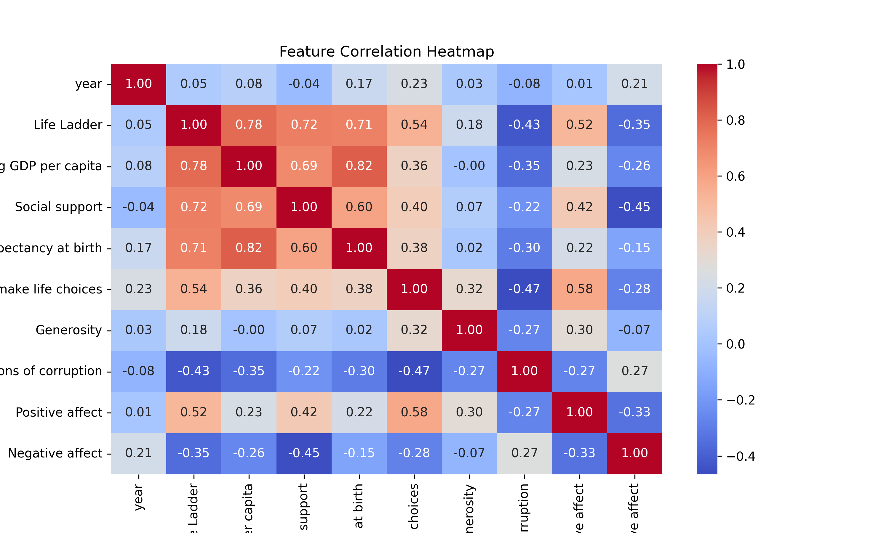

# Automated Data Analysis Report

## Dataset: happiness.csv

### Summary Statistics

|        | Country name   |       year |   Life Ladder |   Log GDP per capita |   Social support |   Healthy life expectancy at birth |   Freedom to make life choices |     Generosity |   Perceptions of corruption |   Positive affect |   Negative affect |
|:-------|:---------------|-----------:|--------------:|---------------------:|-----------------:|-----------------------------------:|-------------------------------:|---------------:|----------------------------:|------------------:|------------------:|
| count  | 2363           | 2363       |    2363       |           2335       |      2350        |                         2300       |                    2327        | 2282           |                 2238        |       2339        |      2347         |
| unique | 165            |  nan       |     nan       |            nan       |       nan        |                          nan       |                     nan        |  nan           |                  nan        |        nan        |       nan         |
| top    | Argentina      |  nan       |     nan       |            nan       |       nan        |                          nan       |                     nan        |  nan           |                  nan        |        nan        |       nan         |
| freq   | 18             |  nan       |     nan       |            nan       |       nan        |                          nan       |                     nan        |  nan           |                  nan        |        nan        |       nan         |
| mean   | nan            | 2014.76    |       5.48357 |              9.39967 |         0.809369 |                           63.4018  |                       0.750282 |    9.77213e-05 |                    0.743971 |          0.651882 |         0.273151  |
| std    | nan            |    5.05944 |       1.12552 |              1.15207 |         0.121212 |                            6.84264 |                       0.139357 |    0.161388    |                    0.184865 |          0.10624  |         0.0871311 |
| min    | nan            | 2005       |       1.281   |              5.527   |         0.228    |                            6.72    |                       0.228    |   -0.34        |                    0.035    |          0.179    |         0.083     |
| 25%    | nan            | 2011       |       4.647   |              8.5065  |         0.744    |                           59.195   |                       0.661    |   -0.112       |                    0.687    |          0.572    |         0.209     |
| 50%    | nan            | 2015       |       5.449   |              9.503   |         0.8345   |                           65.1     |                       0.771    |   -0.022       |                    0.7985   |          0.663    |         0.262     |
| 75%    | nan            | 2019       |       6.3235  |             10.3925  |         0.904    |                           68.5525  |                       0.862    |    0.09375     |                    0.86775  |          0.737    |         0.326     |
| max    | nan            | 2023       |       8.019   |             11.676   |         0.987    |                           74.6     |                       0.985    |    0.7         |                    0.983    |          0.884    |         0.705     |

### Missing Values

|                                  |   0 |
|:---------------------------------|----:|
| Country name                     |   0 |
| year                             |   0 |
| Life Ladder                      |   0 |
| Log GDP per capita               |  28 |
| Social support                   |  13 |
| Healthy life expectancy at birth |  63 |
| Freedom to make life choices     |  36 |
| Generosity                       |  81 |
| Perceptions of corruption        | 125 |
| Positive affect                  |  24 |
| Negative affect                  |  16 |

### Correlation Matrix

|                                  |       year |   Life Ladder |   Log GDP per capita |   Social support |   Healthy life expectancy at birth |   Freedom to make life choices |   Generosity |   Perceptions of corruption |   Positive affect |   Negative affect |
|:---------------------------------|-----------:|--------------:|---------------------:|-----------------:|-----------------------------------:|-------------------------------:|-------------:|----------------------------:|------------------:|------------------:|
| year                             |  1         |     0.0468461 |          0.0801038   |       -0.0430737 |                          0.168026  |                       0.232974 |  0.0308644   |                  -0.0821355 |         0.0130525 |         0.207642  |
| Life Ladder                      |  0.0468461 |     1         |          0.783556    |        0.722738  |                          0.714927  |                       0.53821  |  0.177398    |                  -0.430485  |         0.515283  |        -0.352412  |
| Log GDP per capita               |  0.0801038 |     0.783556  |          1           |        0.685329  |                          0.819326  |                       0.364816 | -0.000765985 |                  -0.353893  |         0.230868  |        -0.260689  |
| Social support                   | -0.0430737 |     0.722738  |          0.685329    |        1         |                          0.597787  |                       0.404131 |  0.0652399   |                  -0.22141   |         0.424524  |        -0.454878  |
| Healthy life expectancy at birth |  0.168026  |     0.714927  |          0.819326    |        0.597787  |                          1         |                       0.375745 |  0.0151682   |                  -0.30313   |         0.217982  |        -0.15033   |
| Freedom to make life choices     |  0.232974  |     0.53821   |          0.364816    |        0.404131  |                          0.375745  |                       1        |  0.321396    |                  -0.466023  |         0.578398  |        -0.278959  |
| Generosity                       |  0.0308644 |     0.177398  |         -0.000765985 |        0.0652399 |                          0.0151682 |                       0.321396 |  1           |                  -0.270004  |         0.300608  |        -0.0719746 |
| Perceptions of corruption        | -0.0821355 |    -0.430485  |         -0.353893    |       -0.22141   |                         -0.30313   |                      -0.466023 | -0.270004    |                   1         |        -0.274208  |         0.265555  |
| Positive affect                  |  0.0130525 |     0.515283  |          0.230868    |        0.424524  |                          0.217982  |                       0.578398 |  0.300608    |                  -0.274208  |         1         |        -0.334451  |
| Negative affect                  |  0.207642  |    -0.352412  |         -0.260689    |       -0.454878  |                         -0.15033   |                      -0.278959 | -0.0719746   |                   0.265555  |        -0.334451  |         1         |

### AI-Generated Insights

The dataset provides an insightful look into the factors that contribute to well-being across various countries from 2005 to 2023, as measured by several indices including the Life Ladder, Log GDP per capita, Social support, Healthy life expectancy at birth, Freedom to make life choices, and others. Here’s a narrative drawn from the statistics:

### A Journey Through Well-Being: Insights from Global Data

As we tread through the complexities of human well-being, we find ourselves armed with a rich dataset that paints a vivid picture of how various factors interplay to shape the quality of life. With 2363 entries representing 165 countries over nearly two decades, this exploration reveals the intricate web connecting economic prosperity, social support, and individual freedoms.

#### Economic Prosperity as a Cornerstone

At the bedrock of this journey lies economic prosperity, as indicated by the **Log GDP per capita**, which holds a strong positive correlation with the **Life Ladder** index (0.78). This relationship suggests that higher economic output per person often leads inhabitants to perceive a higher quality of life. Countries with robust economies allow for better access to resources, leading to elevated life satisfaction.

#### Social Support and Its Crucial Role

Tightly entwined with economic standing is the concept of **social support**, which not only correlates positively with the Life Ladder (0.72) but also significantly enhances well-being. With an average score of 0.80 on a scale where 1 indicates maximum support, the data highlights that societies with strong community bonds promote resilience and satisfaction. Countries that nurture social cohesion provide a safety net which is crucial in times of distress.

#### Health and Longevity: The Life Expectancy Metric 

Another pillar of well-being is **Healthy life expectancy at birth**, with a notable correlation of 0.71 with the Life Ladder. This metric captures how long people can expect to live in good health, serving as a testament to the effectiveness of healthcare systems and lifestyle choices within nations. Countries that prioritize health initiatives enjoy longer, healthier lives, further enriching their citizens' sense of fulfillment.

#### Freedom as an Enabler of Happiness

Furthermore, the **freedom to make life choices** emerges as a notable influencer, correlating positively (0.54) with the Life Ladder. This emphasizes the importance of personal agency and choice in fostering happiness. In societies where individuals feel free to pursue their aspirations without oppressive constraints, life satisfaction tends to soar.

#### The Subtle Dance of Generosity and Corruption

The dataset also reveals intriguing dynamics between **generosity** and **perceptions of corruption**. Although generosity holds a weaker correlation (0.18) with life satisfaction, it hints at a community-oriented mindset that can alleviate some of the pressures from economic hardships. In contrast, perceptions of corruption negatively impact well-being (-0.43), pointing towards the discontent generated by governmental inefficiencies and dishonesty. A populace that trusts its institutions is inherently more satisfied.

#### Emotional Dimensions of Well-Being

Lastly, we examine emotional aspects through **positive** and **negative affects**. Positive affect shows a strong positive correlation (0.51) with life satisfaction, indicating that citizens high on joy and optimism tend to rate their well-being positively. Conversely, negative affect, which captures feelings of distress, inversely correlates (-0.35) with the Life Ladder. The well-being of populations can thus be understood as a balance between positive experiences and the alleviation of negative feelings.

### Concluding Reflections

As we conclude our journey through this intricate dataset, it is evident that well-being is not a static concept; it’s a multifaceted interplay of various elements. Economic stability, social support, health, personal freedoms, and emotional health intricately bind together to influence how individuals perceive their lives. 

For policymakers and leaders, the insights drawn from this analysis can guide interventions aimed at enhancing overall life satisfaction. By fostering economic opportunities, strengthening community bonds, and ensuring health and freedoms, nations can elevate the joy and satisfaction of their citizens, sculpting a future where happiness is not just pursued but embraced as a fundamental right.
### Visualizations

